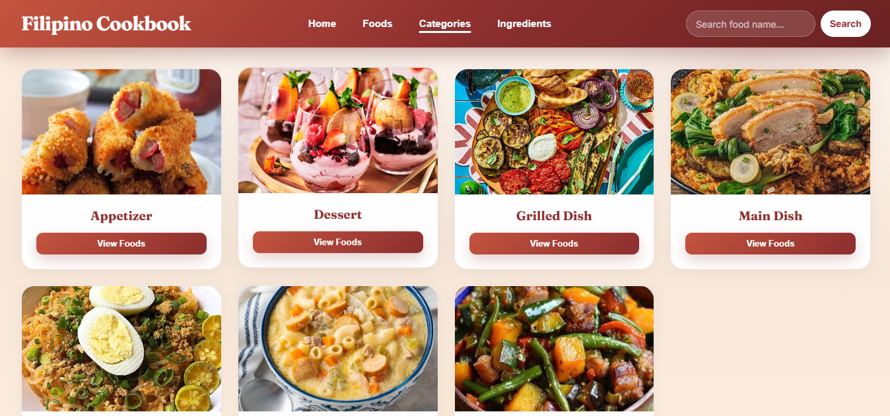
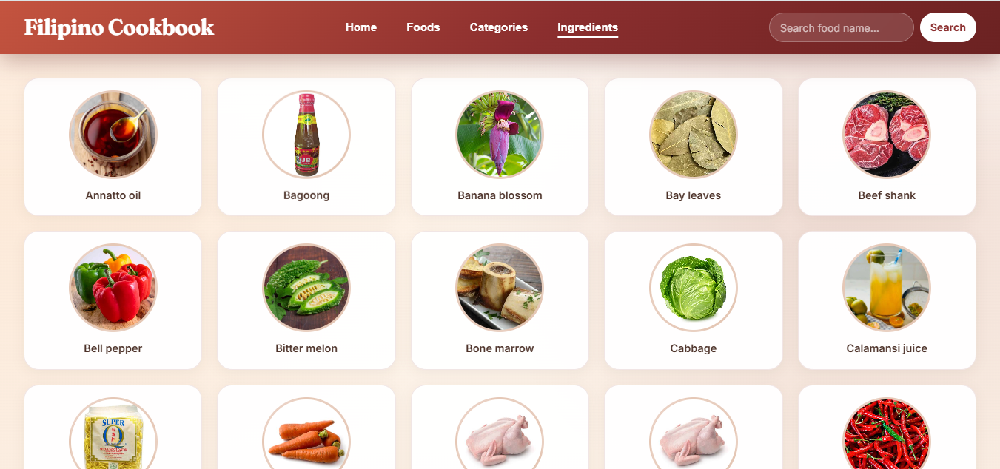

# Filipino Cookbook Client

## Application Description

### Purpose

A web-based client application that consumes the Filipino Cookbook REST API and presents Filipino food information through an interactive user interface. This client application serves as a driver program that retrieves Filipino food information from a classmate's REST API. It demonstrates how a front-end application can consume secured API endpoints, process JSON responses, and display the data in a readable format without accessing the API developer's database directly.

### API Used

This application uses the **Filipino Cookbook API** developed by **Lizhary Ylexis C. Gomez**. All data is retrieved through HTTP API requests using the Fetch API. The client does **not** connect directly to the API developer's MySQL database.

### Major Features

- **Home** — Displays the API welcome message and note retrieved from `GET /api`
- **Foods** — Browse all Filipino foods with category filter chips
- **Categories** — View all food categories and foods under each category
- **Ingredients** — Browse all available ingredients
- **Search** — Search foods by name from the header search bar
- **Random Food** — Display a randomly selected food item
- **Add Food** — Submit a new food record to the API via a form

### Intended Users

- Students completing API integration laboratory activities
- Users who want to explore Filipino recipes through a web interface
- Anyone learning how to build a client application that consumes a REST API

---

## Technologies Used

- HTML5
- CSS3
- JavaScript (Vanilla)
- Fetch API
- JSON
- XAMPP (Apache)
- PHP Built-in Server (classmate's API)

---

## Installation Instructions

### Prerequisites

- XAMPP or any local web server
- The Filipino Cookbook API (by Lizhary Ylexis Gomez) installed and running
- A valid API token matching the API's `config.php`

### Step 1: Clone the repository

```bash
git clone https://github.com/cmc06-boop/filipino-cookbook-client-casilla.git
cd filipino-cookbook-client-casilla
```
```bash
cd filipino-cookbook-client-casilla
```

### Step 2: Start the API server

Clone and run the classmate's API first:

```bash
git clone https://github.com/Yelsxii/filipino-cookbook-api-gomez.git
```
```bash
cd filipino-cookbook-api-gomez
```
```bash
composer install
```

**Windows:**
```powershell
copy config.example.php config.php
```

Edit `config.php` with your database credentials and API token, then start the server:

```bash
php -S 127.0.0.1:8080 -t public
```

### Step 3: Configure the client

Copy the example configuration file:

**Windows:**
```powershell
copy js\config.example.js js\config.js
```

Edit `js/config.js`:

```javascript
const API_CONFIG = {
    baseUrl: "http://127.0.0.1:8080",
    token: "YOUR_API_TOKEN"
};
```

Replace `YOUR_API_TOKEN` with the same token value configured in the API's `config.php`.

> **Note:** `js/config.js` is listed in `.gitignore` and must not be committed to a public repository.

### Step 4: Run the client application

Open in a browser:

```
http://localhost/filipino-cookbook-client-casilla/
```

Ensure the API server is running before using the client.

---

## API Endpoints Used

The following endpoints from the Filipino Cookbook API are consumed by this client application. Secured endpoints require `Authorization: Bearer YOUR_API_TOKEN` and `Accept: application/json`.

- **GET /api** — Returns the API welcome message and note. Used on the Home page.
- **GET /api/foods** — Returns all foods with category, origin, instructions, and ingredients. Used on the Foods page.
- **GET /api/foods/{id}** — Returns full details for one food item. Used in the food details modal.
- **GET /api/foods/search/{name}** — Searches foods by name (case-insensitive). Used in the header search feature.
- **GET /api/categories** — Returns all food categories. Used on the Categories page, Foods filter chips, and Add Food form.
- **GET /api/categories/{id}/foods** — Returns foods belonging to a specific category. Used in the category filter and category modal.
- **GET /api/ingredients** — Returns all ingredients. Used on the Ingredients page and Add Food form.
- **GET /api/foods/random** — Returns one randomly selected food. Used in the random food feature.
- **POST /api/foods** — Adds a new food record with validation. Used in the Add Food form.

---

## Screenshots

### Home Page

<p align="center">
  
</p>
<p align="center"><em>Welcome message and note loaded programmatically from GET /api.</em></p>

### Foods Page

<p align="center">
  
</p>
<p align="center"><em>Food cards retrieved from GET /api/foods with category filter chips.</em></p>

### Food Details

<p align="center">
  
</p>
<p align="center"><em>Full food details displayed from GET /api/foods/{id}.</em></p>

### Categories

<p align="center">
  
</p>
<p align="center"><em>Category list from GET /api/categories.</em></p>

### Food Per Category

<p align="center">
  
</p>
<p align="center"><em>Foods under a selected category from GET /api/categories/{id}/foods.</em></p>

### Ingredients

<p align="center">
  
</p>
<p align="center"><em>Ingredient grid from GET /api/ingredients.</em></p>

### Food Search

<p align="center">
  
</p>
<p align="center"><em>Search results displayed from GET /api/foods/search/{name} when a matching food is found.</em></p>


### Random Food

<p align="center">
  
</p>
<p align="center"><em>Random food displayed from GET /api/foods/random.</em></p>

### Add Food

<p align="center">
  
</p>
<p align="center"><em>Add Food form for submitting data via POST /api/foods.</em></p>

### Add Food Success

<p align="center">
  
</p>
<p align="center"><em>Success confirmation after a valid POST /api/foods request.</em></p>

### Empty Search

<p align="center">
  
</p>
<p align="center"><em>No matching results from GET /api/foods/search/{name} when the search term is invalid or not found.</em></p>

### Invalid Token (Error Testing)

<p align="center">
  
</p>
<p align="center"><em>Error message displayed when an invalid API token is used.</em></p>

### API Offline (Error Testing)

<p align="center">
  
</p>
<p align="center"><em>Error message displayed when the API server is not running or unreachable.</em></p>

---

## API Source and Acknowledgment

### API Source

This client application uses the Filipino Cookbook API developed by:

**Developer:** Lizhary Ylexis C. Gomez  
**GitHub Username:** Yelsxii  
**GitHub Repository:** https://github.com/Yelsxii/filipino-cookbook-api-gomez.git

The API is used for educational purposes with the permission of the developer.

### Client Developer

**Client developed by:** Cherry Lyn M. Casilla

---

## Project Structure

```
filipino-cookbook-client-casilla/
├── index.html
├── css/
│   └── style.css
├── js/
│   ├── app.js
│   ├── config.js              (local only, gitignored)
│   └── config.example.js
├── images/
├── Screenshots/
├── .gitignore
└── README.md
```